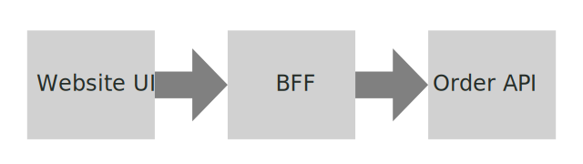

# Specmatic Sample: UI calling BFF

* [Specmatic Website](https://specmatic.in)
* [Specmatic Documenation](https://specmatic.in/documentation.html)

This sample project contains a small static website built using HTML and plain javascript that demonstrates how we can contract driven development and testing of client side/front end by stubbing calls to BFF using specmatic stub option and backend OpenAPI spec. 

Here is the BFF [contract/open api spec](https://github.com/znsio/specmatic-order-contracts/blob/main/in/specmatic/examples/store/api_order_v1.yaml)

## Definitions
* BFF: Backend for Front End
* Domain API: API managing the domain model
* Specmatic Stub Server: Create a server that can replace a real service using its open api spec

## Background
A typical web application might look like this. Specmatic can contract driven development and testing of all the three components below. In this sample project, we look how to do this for the UI which is dependent on BFF.



_The architecture diagram was created using the amazing free online SVG editor at [Vectr](https://vectr.com)._

## Tech
1. HTML, Javascript
2. Specmatic
3. Karma, Mocha
 
## Start UI
This will start the static server for front end UI
```shell
npm start
```
Access UI at http://localhost:3000
_*Note:* Unless BFF is running on port 8082, above UI will not present any data. Move to next section for solution!_

## Start UI with BFF Stub
This will start the static server with BFF stubbed
```shell
npm run startWithStub
```
Access UI again at http://localhost:3000 with random order data presented each time the page is refreshed.

## Run Tests
This will start the specmatic stub server for BFF and run the karma tests on headless chrome.
```shell
npm test
```
